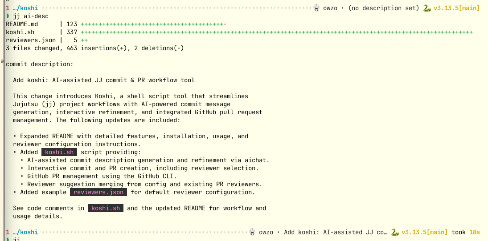

# Koshi

**Koshi** gives your [Jujutsu (jj)](https://github.com/jj-vcs/jj) projects a powerful lift with AI-assisted commit messages, interactive refinement, and a streamlined GitHub Pull Request workflow — all from your terminal.



---

## Features

- **AI-powered commit descriptions**
  Generate and iteratively refine commit messages for your JJ commits using [aichat](https://github.com/sigoden/aichat). Accept or refine suggestions interactively based on your diffs.
- **Tight GitHub integration**
  Effortlessly create and update GitHub PRs from your JJ commits with [`gh`](https://cli.github.com/).
- **Interactive terminal UI**
  Uses [gum](https://github.com/charmbracelet/gum) for beautiful, user-friendly command-line interactions and formatting.
- **Smart reviewer management**
  Select reviewers for PRs interactively; merges suggestions from your config and any previous PR reviewers.
- **Automated commit validation**
  Run project-specific checks on commits before creating pull requests to ensure code quality.

---

## Usage


### Generate/Refine Commit Message with AI

```sh
koshi ai-desc [--role "<ROLE>"] [--ticket "<TICKET_ID>"] [--fixes "<TICKET_ID>"] [--commit] [--pull_request]
```

- `--role <ROLE>`: Override the configured AI assistant's role.
- `--ticket <TICKET_ID>`: Reference a ticket or issue ID in the commit message.
- `--fixes <TICKET_ID>`: Indicate a ticket that this commit fixes (the prompt to the AI assistant will explicitly mention that this change fixes the provided ticket).
- `--commit`: After confirming the description, automatically create a new commit.
- `--pull_request`: Automatically open or update a GitHub pull request.

If no `--role` is specified, Koshi uses the role from your configuration file (project-specific if available, otherwise the default).

### Split Commits with AI Assistance

```sh
koshi ai-split [--role "<ROLE>"] [--ticket "<TICKET_ID>"] [--pull_request]
```

- `--role <ROLE>`: Override the configured AI assistant's role.
- `--ticket <TICKET_ID>`: Reference a ticket or issue ID in the commit message.
- `--pull_request`: Automatically open or update a GitHub pull request.

This command intelligently splits the current Jujutsu commit into two separate commits:
1. Interactively select which changes to include in the first commit using `jj split`
2. Automatically generate an AI-powered description for the first split commit
3. Position you to describe the second commit later

This is particularly useful for breaking up large changes into more focused, atomic commits while leveraging AI assistance for writing clear commit messages.

### Create or Update Pull Request

```sh
koshi pr
```

This command lets you review or edit your commit description, pushes your commit to GitHub, and creates or updates a pull request. When opening or updating a PR, Koshi will prompt you to select reviewers interactively based on your configuration.

### Check Commit

```sh
koshi check-commit
```

Runs all configured validation commands for the current project on the current commit. This command executes each check sequentially and exits immediately if any check fails. It's automatically run before creating pull requests to ensure code quality standards are met.

### Display or Edit Configuration

```sh
koshi config [--edit]
```

- Without flags: Displays the current configuration file contents
- `--edit`: Opens the configuration file in your default editor (`$EDITOR`)

This command provides quick access to view or modify your koshi configuration, including AI roles and project-specific settings. The config file location defaults to `~/.config/koshi/config.json` but can be overridden with the global `--config` option.

---

## Requirements

- [jj](https://github.com/jj-vcs/jj) (Jujutsu)
- [argc](https://github.com/sigoden/argc)
- [gum](https://github.com/charmbracelet/gum)
- [aichat](https://github.com/sigoden/aichat)
- [gh](https://cli.github.com/) (GitHub CLI)
- [jq](https://stedolan.github.io/jq/) (for JSON parsing)

All must be available in your `$PATH`.

---

## Installation

1. Copy `koshi.sh` into a directory in your `$PATH` and make it executable:

   ```sh
   cp koshi.sh ~/bin/koshi
   chmod u+x ~/bin/koshi
   ```

2. Install all dependencies using your system package manager or from their respective repositories.

3. (Optional) Integrate `koshi` with `jj` by adding aliases in your `.jj/config.toml`:

   ```toml
   [aliases]
   ai-desc   = ['util', 'exec', '--', 'koshi', 'ai-desc']
   ai-commit = ['util', 'exec', '--', 'koshi', 'ai-desc', '--commit']
   ```

4. Create the configuration file at `~/.config/koshi/config.json` (see [Configuration](#configuration) for details).

---

## Configuration

Koshi uses a single configuration file at `~/.config/koshi/config.json` to manage both AI roles and reviewer suggestions. You can override this location with the `--config` option.

### Configuration Structure

```json
{
  "ai_description_role": "code-author",
  "project_settings": {
    "$HOME/projects/myproject": {
      "ai_description_role": "backend-engineer",
      "reviewers": ["alice", "bob"],
      "check_commit_commands": ["cargo check", "cargo test"]
    },
    "$HOME/projects/frontend": {
      "ai_description_role": "frontend-developer",
      "reviewers": ["carol", "dave"],
      "check_commit_commands": ["npm run lint", "npm test"]
    }
  }
}
```

### Configuration Fields

#### Global Settings

- **`ai_description_role`**: The default AI role to use when generating commit descriptions. This is used when no project-specific role is configured.

#### Project Settings

The `project_settings` object contains project-specific configurations, keyed by the full filesystem path to your repository (with `$HOME` as a variable).

For each project, you can configure:

- **`ai_description_role`**: Project-specific AI role that overrides the global default
- **`reviewers`**: Array of GitHub usernames to suggest as default reviewers for pull requests
- **`check_commit_commands`**: Array of shell commands to run for commit validation. Each command is executed in sequence, and if any command fails (returns non-zero exit code), the check-commit process stops immediately with an error.

### What is an AI Role?

An AI role is a configuration for `aichat` that defines the persona and behavior of the AI assistant when generating commit messages. Roles tell the AI:
- How to format commit messages (e.g., title length, body formatting)
- What tone and perspective to use (e.g., "engineer sending code for review")
- What information to include or exclude
- Special rules or patterns to follow

Roles are defined in your `aichat` configuration. See the [aichat Role Guide](https://github.com/sigoden/aichat/wiki/Role-Guide) for instructions on how to configure roles.

The [`role.md`](role.md) file in this repository shows an example of a well-structured role definition that:
- Formats commits with a 50-character title line
- Includes ticket references when provided
- Marks work-in-progress with "WIP:" prefix
- Keeps descriptions proportional to code changes

### AI Role Resolution

When determining which AI role to use, Koshi follows this precedence:

1. Command-line `--role` argument (highest priority)
2. Project-specific `ai_description_role` from `project_settings`
3. Global `ai_description_role`
4. Exit with an error if no role is configured

The AI role is passed to `aichat` and should match a role you've configured there.

### Reviewer Suggestions

When creating or updating a pull request, Koshi will:

1. Look for reviewers configured for the current project in `project_settings`
2. Merge these with any existing reviewers on the pull request
3. Present the combined set for interactive selection

### Commit Validation

The `check_commit_commands` field allows you to define project-specific validation rules that run automatically:

- **When manually invoked**: Run `koshi check-commit` to validate the current commit
- **Before pull requests**: Automatically runs before creating or updating PRs (when using `--pull_request` flag or `koshi pr` command)
- **Common use cases**: Linting, type checking, running tests, checking formatting

Commands are executed in the repository root and their output is suppressed unless they fail. Examples include:
- Rust projects: `["cargo check", "cargo fmt --check", "cargo clippy"]`
- Node.js projects: `["npm run lint", "npm test", "npm run type-check"]`
- Python projects: `["ruff check", "mypy .", "pytest"]`

---

## Example Workflow

```sh
# Configure project-specific settings
$ cat > ~/.config/koshi/config.json << EOF
{
  "ai_description_role": "code-author",
  "project_settings": {
    "$HOME/projects/backend": {
      "ai_description_role": "backend-engineer",
      "reviewers": ["alice", "bob", "charlie"],
      "check_commit_commands": ["cargo check", "cargo test"]
    }
  }
}
EOF

# Work on a feature
$ cd ~/projects/backend
$ jj new
# ...make code changes...

# Generate AI commit message (uses "backend-engineer" role automatically)
$ koshi ai-desc --ticket ABC-123 --commit --pull_request
```

Koshi will:
1. Show the diff
2. Use the "backend-engineer" AI role to propose a commit message
3. Let you refine it interactively
4. Run `cargo check` and `cargo test` to validate the commit
5. Commit the changes
6. Create a PR with `alice`, `bob`, and `charlie` as suggested reviewers

---

## License

MIT (see LICENSE)
